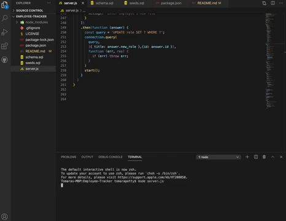
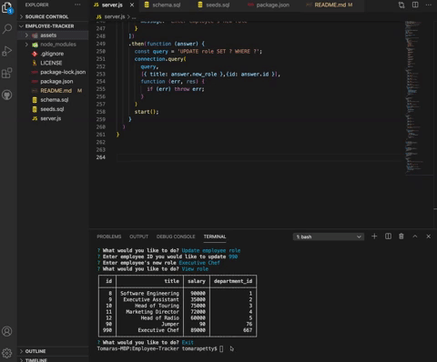

# Employee-Tracker


<a href="https://youtu.be/zyPnBDruayo">Click here to see it in action.</a>

## Table of Contents
* [Description](#description)
* [Installation](#installation)
* [Usage](#usage)
* [License](#license)
* [Contributions](#contributions)
* [Tests](#tests)
* [Questions](#questions)

## Description 
*Overview of this project:* <br> 
As a business owner I want to be able to view and manage the departments, roles, and employees in my company so that I can organize and plan my business. <br>
* The CMS includes one SQL database with three tables. <br>
`Employee | Role | Department` <br>
* Inquirer is used to prompt the user for information about the employees, roles and departments.
* The user can:
    1. Add employees
    2. Add Departments
    3. Add Roles
    4. View Employees
    5. View Roles
    6. View Departments
    7. Update employee roles
* If the user is trying to "view" information it will be pulled up in a table. 
* If the user wants to update or add information Inquirer will ask the proper questions and once answered, the information will be updated into the database.

## Installation
*Steps required to install project and get the development environment established:*
* Simply clone this repo and then enter `npm install` into your terminal to install all necessary packages to launch the Employee-Tracker application! 

```bash
npm install
node server.js
```

## Usage
*Instructions and examples for use:* 
* Once the application is installed you will need to start a database in your MySQL Workbench. 
* Enter the schema into your database and then add the seeds. 
* Type `node server.js` into the terminal to run the application in your terminal.  
* Answer the questions that you are prompted to answer in order to add or view data.

#### Employee, department and role "Add" functionality:


#### Employee, department and role "View" functionality:


#### Click here to see the full video: 
https://youtu.be/zyPnBDruayo

## License 
* Built under the MIT licence.

## Credits
* Built by Tomara Petty

## Test
* No tests required. 

## Questions?
<p float="left">

</p>

#### If you have any questions or want to make a contribution please reach out to me here:

**GitHub:**  
@tomarapetty

**Email:** 
tomararuth@gmail.com 

**LinkedIn:** 
Tomara: https://www.linkedin.com/in/tomara-petty/ 

